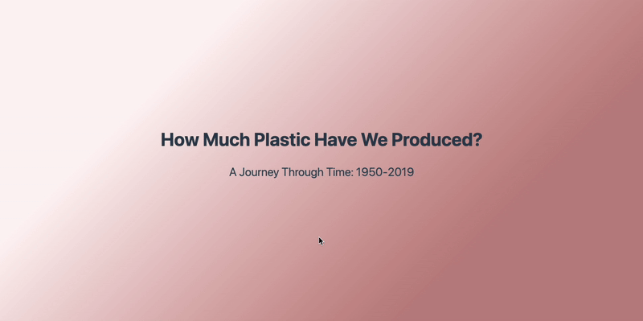
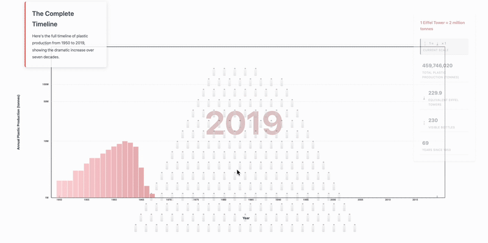

# Global Plastic Production Visualization (1950–2019)



This interactive data visualization explores the dramatic growth of global plastic production from 1950 to 2019. Built with D3.js, it uses scroll-driven storytelling and creative visual metaphors to help users grasp the scale of plastic production over time.



## Overview

- **Scroll-driven narrative:** As you scroll, the visualization transitions through key stages in the history of plastic production.
- **Visual metaphors:** Plastic bottles and the Eiffel Tower are used as reference points to make the numbers more tangible.
- **Interactive controls:** Users can select a year, play an animation, or reset the view.

## Features

- **Pyramid of Bottles:** Each bottle represents the volume of plastic that would fill one Eiffel Tower (2 million tonnes). The pyramid grows as production increases.
- **Eiffel Tower Reference:** The Eiffel Tower image is used to help users relate to the scale of plastic production.
- **Bar Chart:** At the end of the scroll, a bar chart summarizes annual plastic production across the full timeline.
- **Info Panel:** Displays detailed statistics for the selected year, including total production, Eiffel Tower equivalents, and years since 1950.

## User Interactions

- **Scroll:** Progresses through the story, revealing new visual elements and transitions.
- **Year Selector:** Choose a specific year to view the corresponding data.
- **Play/Pause:** Animates the growth of plastic production over time.
- **Reset:** Returns the visualization to the starting year.
- **Responsive Design:** Layout and visuals adapt to different screen sizes.

## Data Source

- `imp/global-plastics-production.csv` — Contains annual global plastic production data (1950–2019).

## Main Files

- `figure-1.html` — Main HTML file for the visualization.
- `figure-1.js` — D3.js code for rendering and interactivity.
- `figure-1.css` — Styles for layout and appearance.
- `imp/global-plastics-production.csv` — Data file.
- `resources/eiffele tower_bg.png` — Eiffel Tower image.
- `resources/plastic_bottle.png` — Plastic bottle image.

## How to Run

1. **Open `figure-1.html` in your web browser.**
   - For best results, use a local web server (to avoid issues with loading local images and data):
   ```sh
   python3 -m http.server
   # Then visit http://localhost:8000 in your browser
   ```
2. **Scroll through the page** to experience the narrative and visual transitions.
3. **Use the controls** at the bottom left to select a year, play/pause the animation, or reset the view.

## Requirements

- Modern web browser (Chrome, Firefox, Edge, etc.)
- [D3.js v7](https://d3js.org/) (loaded via CDN)

## Credits

- Visualization by Shivam Sharma
- Data: Our World in Data
- Images: Custom plastic bottle and Eiffel Tower graphics

---
